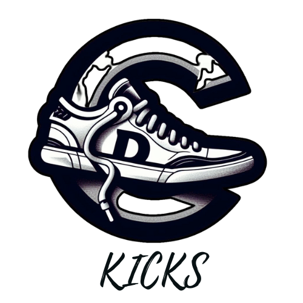

<a name="readme-top">

<br/>

<br />
<div align="center">
  <a href="https://github.com/Iconiq2">
    
  </a>
  <h3 align="center">WD_SUNGA_SEATWORK_3</h3>
</div>
<div align="center">
  Core header and footer design principles, featuring both static and dynamic effects created using HTML and CSS.
</div>

<br />


---

<br />
<br />

<details>
  <summary>Table of Contents</summary>
  <ol>
    <li>
      <a href="#overview">Overview</a>
      <ol>
        <li>
          <a href="#key-components">Key Components</a>
        </li>
        <li>
          <a href="#technology">Technology</a>
        </li>
      </ol>
    </li>
    <li>
      <a href="#rule,-practices-and-principles">Rules, Practices and Principles</a>
    </li>
    <li>
      <a href="#resources">Resources</a>
    </li>
  </ol>
</details>

---

## Overview

This project showcases the implementation of HTML and CSS to create various styles of headers and footers, including animated designs. It aims to provide practical experience in coding while delivering tangible outputs.

### Key Components
- Headers Page:
  - A collection of 10 unique headers highlighting various designs and features.
  - Each header incorporates elements such as navigation menus, logos, search bars, or other relevant components.
- Footers Page:
 - Includes 10 distinct footers, categorized into 5 static and 5 animated versions.
 - Static footers provide fixed content like copyright details, contact links, and navigation menus.
 - Animated footers include dynamic and interactive elements with engaging visual effects.


### Technology


## Rules, Practices and Principles
1. Always use `WD-` in the front of the Title of the Project for the Subject followed by your custom naming.
2. Do not rename any .html files; always use `index.html` as the filename.
3. Place Files in their respective folders.
4. All file naming are in camel case.
   - Camel case is naming format where there is no white space in separation of each words, the first word is in all lower case while the succeding words first letter are in upper followed by lower cased letters.
   - ex.: buttonAnimatedStyle.css
5. Use only `External CSS`.
6. Renaming of Pages folder names are a must, and relates to what it is doing or data it holding.
7. File Structure to follow below.

```
WD-ProjectName
└─ assets
|   └─ css
|   |   └─ style.css
|   └─ img
|   |   └─ fileWith.jpeg/.jpg/.webp/.png
|   └─ js
|       └─ script.js
└─ pages
|  └─ pageName
|     └─ assets
|     |  └─ css
|     |  |  └─ style.css
|     |  └─ img
|     |  |  └─ fileWith.jpeg/.jpg/.webp/.png
|     |  └─ js
|     |     └─ script.js
|     └─ index.html
└─ index.html
└─ readme.md
```

## Resources

| Title | Purpose | Link |
|-|-|-|
| HTML & CSS Full Course for free | To learn css and html. | trykolang.com |
